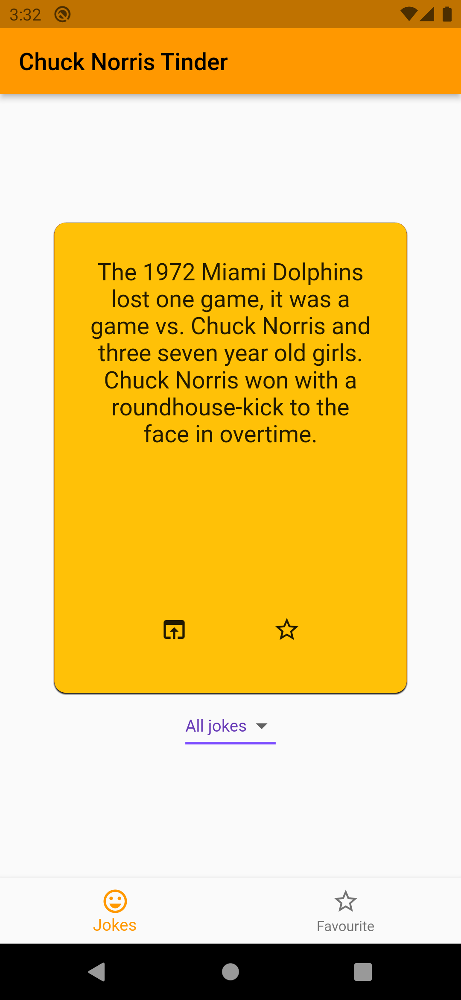
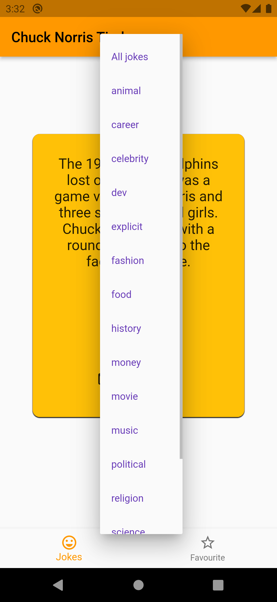
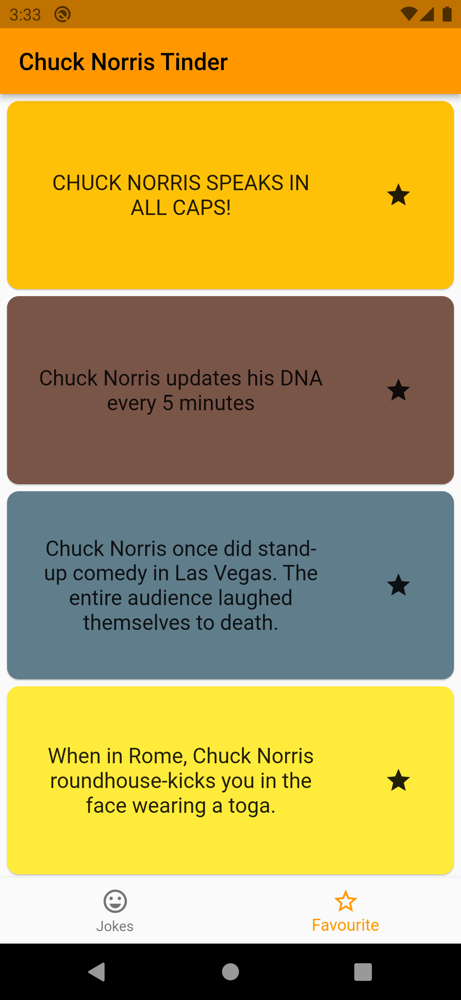

# Chuck Norris Tinder

A flutter application of a Tinder-like interface to browse Chuck Norris jokes.

## Description

This flutter application contains Tinder-like swiping cards containing Chuck Norris jokes taken from
public [Chuck Norris jokes API](https://api.chucknorris.io).

Swiping a card reveals another joke.

## Additional features

* A joke can be viewed from browser by clicking `Open in Browser` button at the bottom of each card.
* Jokes can be saved as favourites by clicking the `Star` button
* Favorite jokes may be viewed in a separate screen.
* Jokes can be filtered by genre.

## Download

[Download APK](https://github.com/markovav-official/ChuckNorrisTinder/releases/tag/v2.0.0)

## Screenshots

| Default view                                                     | Card swipe                                                 | Category selector                                                      | Favourites                                                 |
|------------------------------------------------------------------|------------------------------------------------------------|------------------------------------------------------------------------|------------------------------------------------------------|
|  |  |  |  |
